<div align="center">

# CBCTF

**A Kubernetes-Native Modern CTF Competition Platform**

[](https://golang.org)
[](https://react.dev)
[](https://kubernetes.io)
[](https://www.postgresql.org)
[](https://redis.io)
[](LICENSE)

English · [简体中文](README.md)

</div>

---

CBCTF is a CTF competition platform maintained by [0RAYS](https://github.com/0rays), built with Go and natively
orchestrated on Kubernetes. It supports dynamic attachment generation, dynamic container distribution, hybrid
container/VM deployments, and network penetration scenario construction.

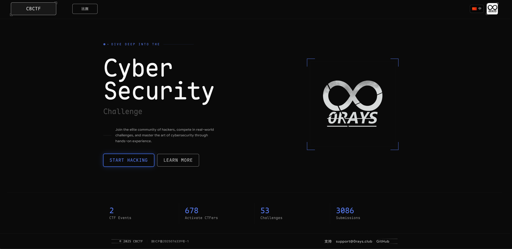

## Features

### Challenge Types

| Type                             | Description                                                                                   |
|----------------------------------|-----------------------------------------------------------------------------------------------|
| **Static**                       | All teams share the same attachment and flag                                                  |
| **Dynamic Attachment**           | Containers generate unique attachments per team, each with a different flag                   |
| **Dynamic Container · Pod Mode** | Multiple containers share one Pod network; containers communicate via `localhost`             |
| **Dynamic Container · VPC Mode** | Each container runs in its own Pod with static IP assignment. Ideal for penetration scenarios |

Each challenge supports multiple flags, each scored independently.

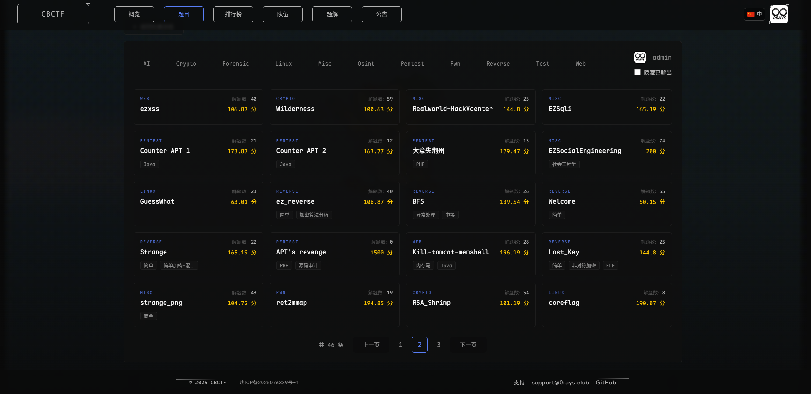

### Flag Types

The flag prefix can be customized in event settings (default: `CBCTF`):

| Type     | Raw Value                | Actual Flag                                   |
|----------|--------------------------|-----------------------------------------------|
| `static` | `static{this_is_a_flag}` | `CBCTF{this_is_a_flag}`                       |
| `leet`   | `leet{this_is_a_flag}`   | `CBCTF{ThiS-ls_4-fIaG}`                       |
| `uuid`   | `uuid{}`                 | `CBCTF{1301ea62-ccd2-4543-b663-993f87b6d44a}` |

### Platform Capabilities

- **Dynamic Scoring** — 1st/2nd/3rd blood earn an additional 5% / 3% / 1% of the challenge score
- **Frp Port Forwarding** — Container port tunneling with original client IP preserved
- **SMTP Email Verification** — Registration confirmation and password recovery
- **Writeup Management** — Collection and bulk download support
- **OAuth / OIDC** — Third-party authentication with automatic user group assignment
- **Platform Branding** — Global configuration for logo, name, theme color, etc.
- **Online Settings** — Manage runtime settings in the admin panel; changes apply on save or after a restart, depending on the setting
- **Webhook** — GET / POST
- **Internationalization (i18n)** — Multi-language interface support
- **Prometheus Metrics** — Full runtime metric exposure
- **Redis Cache / Task Queue** + **PostgreSQL Storage** + **NFS Network Storage**

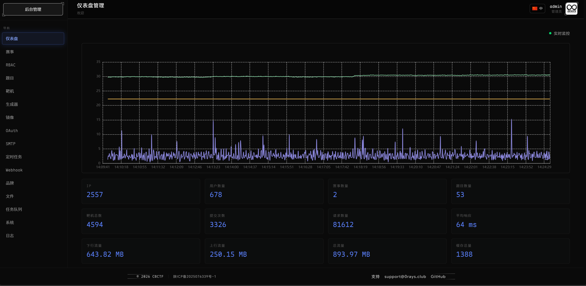
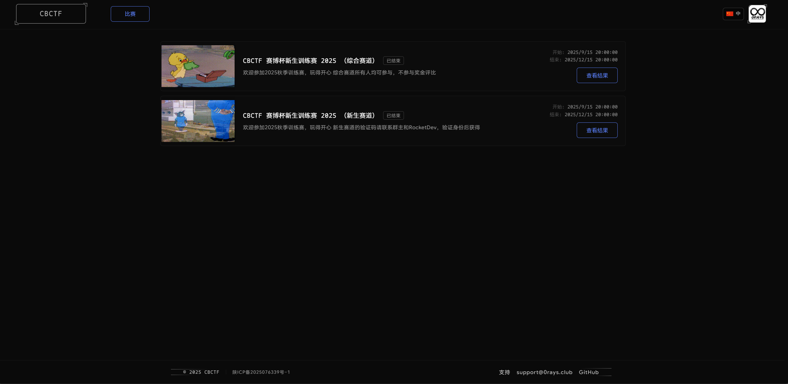
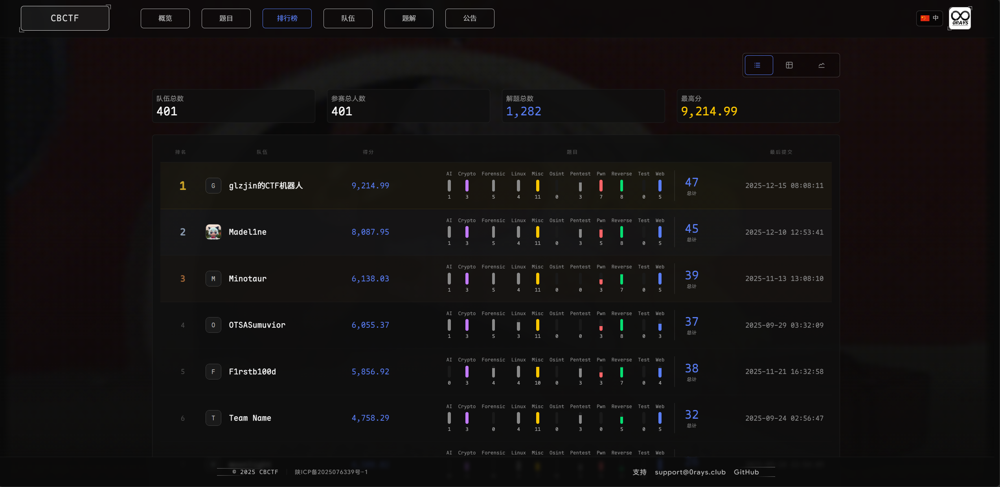
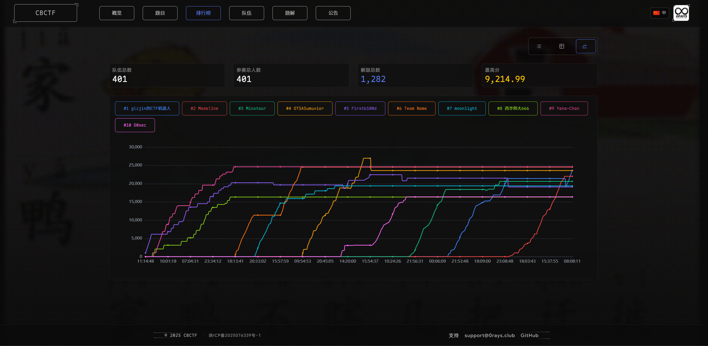
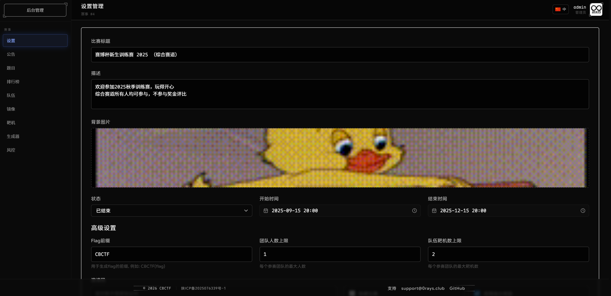
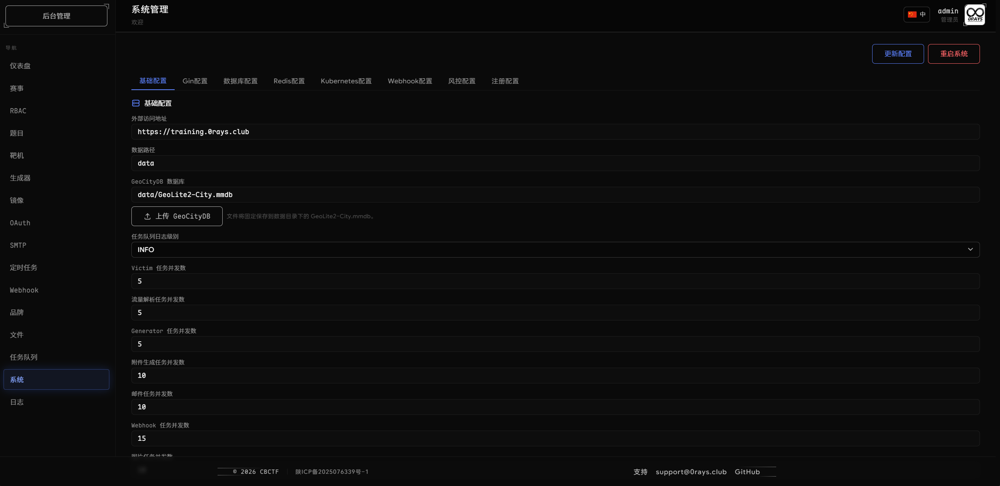
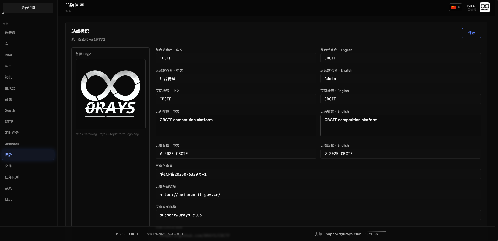
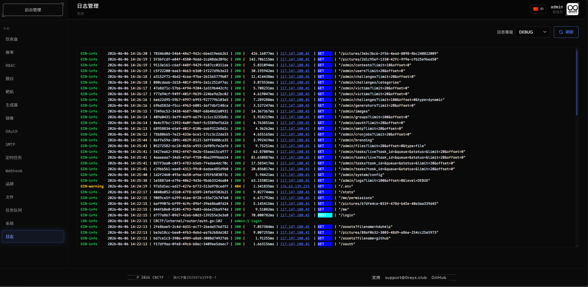

## Getting Started

- **Deploy the platform**: follow the [Quick Start](docs/docs/guide/start/quick-start.mdx) to prepare Kubernetes and install with Helm.
- **Organize a contest**: use the [Contest Management guide](docs/docs/admin/contests.md) to create a contest, add challenges, and check participant access.
- **Participate**: follow the [Player Guide](docs/docs/guide/features/playing.md) for email verification, teams, and challenges.

These guides are currently available in Chinese.

## Dynamic Containers

### Network Modes

Choose the network mode in the challenge's Compose configuration:

| Mode    | Condition                      | Description                                                            |
|---------|--------------------------------|------------------------------------------------------------------------|
| **Pod** | No `networks` field configured | Uses the default network; containers can communicate directly          |
| **VPC** | `networks` field is configured | Kube-OVN VPC network isolation; IP addresses must be assigned manually |

### Configuration Examples

**Pod Mode**

```yaml
version: '3'
services:
  web:
    image: nginx:alpine
    x-kubevirt: false
    ports:
      - "80:80"
```

> Full example: [example/pods/pod/docker-compose.yaml](example/pods/pod/docker-compose.yaml)

**VPC Mode (with KubeVirt VM)**

```yaml
version: '3'
services:
  web:
    # Use a bootable containerDisk image
    image: registry.example.com/challenges/vm-web:v1
    mem_limit: 512m
    x-kubevirt: true
    x-boot:
      bootloader: efi
      secure_boot: false
    x-cloudinit:
      users:
        - name: root
    networks:
      vpc:
        ipv4_address: 192.168.1.10
        mac_address: "00:00:00:00:01:01"
networks:
  vpc:
    ipam:
      config:
        - subnet: 192.168.1.0/24
          gateway: 192.168.1.1
```

> Full example: [example/pods/vpc/docker-compose.yaml](example/pods/vpc/docker-compose.yaml)

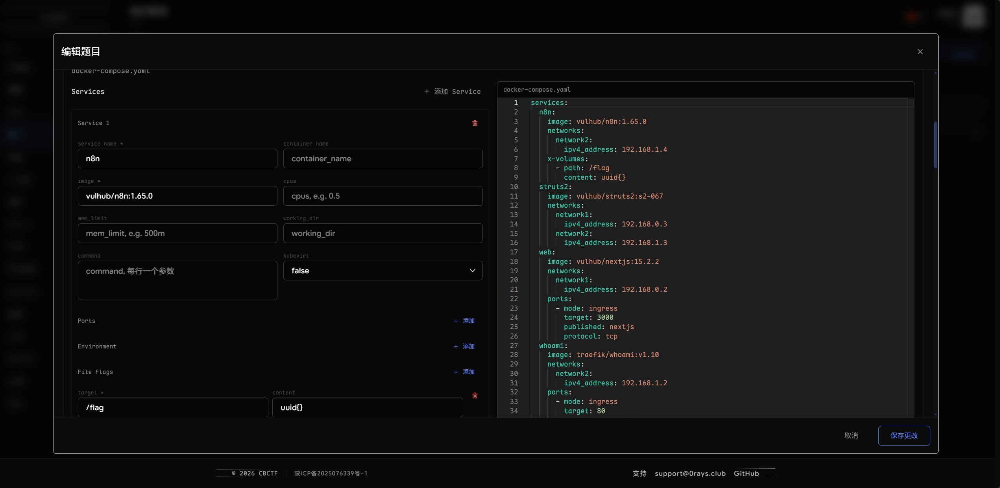
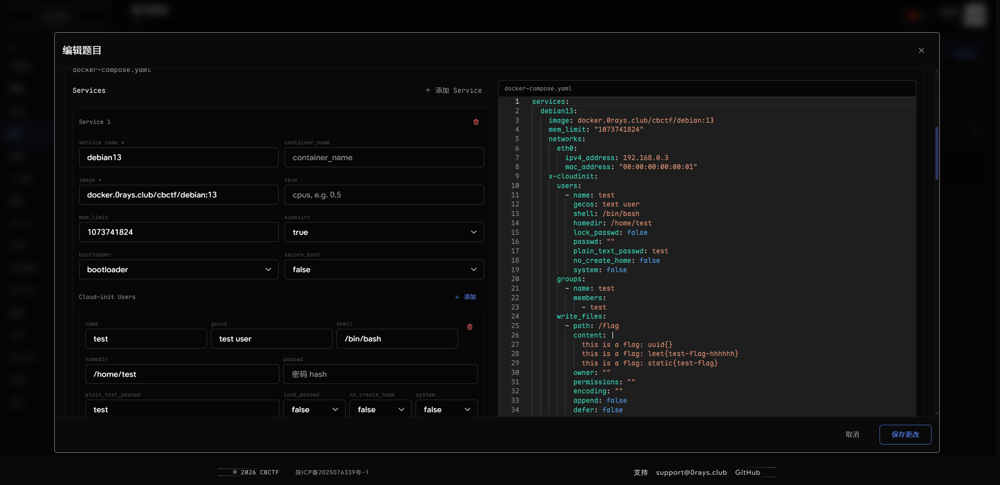
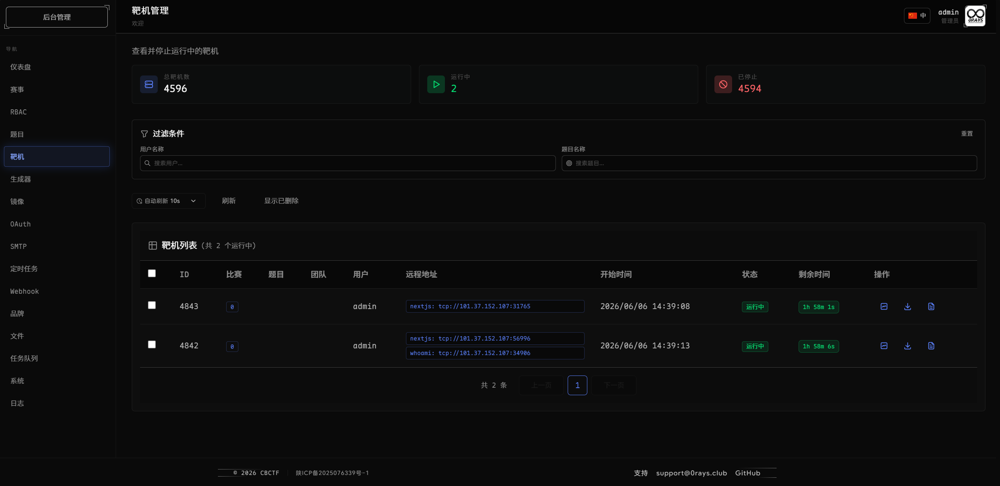
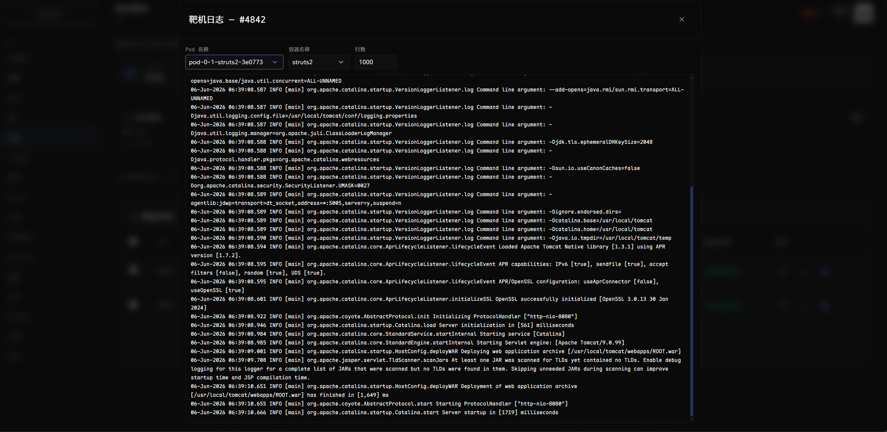

## Dynamic Attachment

Containerized generation on Kubernetes. Upload a Python script and the platform runs it in an isolated environment to
produce a unique attachment for each team.

**Preparing a generator:**

- Container must include `sleep` and `unzip`
- Script must be located at `/root/run.sh <team_id> <base64_encoded_flags>`
- Output must be written to `/root/mnt/attachments/{id}.zip`
- Pin an image version or digest to keep the environment consistent throughout the contest

> Full example (RSA crypto challenge): [example/dynamic/README.md](example/dynamic/README.md)

## Kubernetes Dependencies

Dynamic containers and dynamic attachments require the following components:

| Component                                                        | Purpose                            |
|------------------------------------------------------------------|------------------------------------|
| [Kube-OVN](https://kubeovn.github.io/docs/stable/start/prepare/) | VPC network isolation              |
| [Multus CNI](https://github.com/k8snetworkplumbingwg/multus-cni) | Multiple network interface support |
| [KubeVirt](https://kubevirt.io/)                                 | VirtualMachine support             |

## License

This project is licensed under the [GNU Affero General Public License v3.0](LICENSE).
