<div align="center">

# CBCTF

**基于 Kubernetes 的现代化 CTF 竞赛平台**

[](https://golang.org)
[](https://react.dev)
[](https://kubernetes.io)
[](https://www.postgresql.org)
[](https://redis.io)
[](LICENSE)

[English](README-EN.md) · 简体中文

</div>

---

CBCTF 是由 [0RAYS](https://github.com/0rays) 维护的 CTF 竞赛平台，基于 Go 语言构建，原生支持
Kubernetes编排。平台支持动态附件生成、动态容器分发、容器与虚拟机混合部署、网络渗透场景构建等特性。

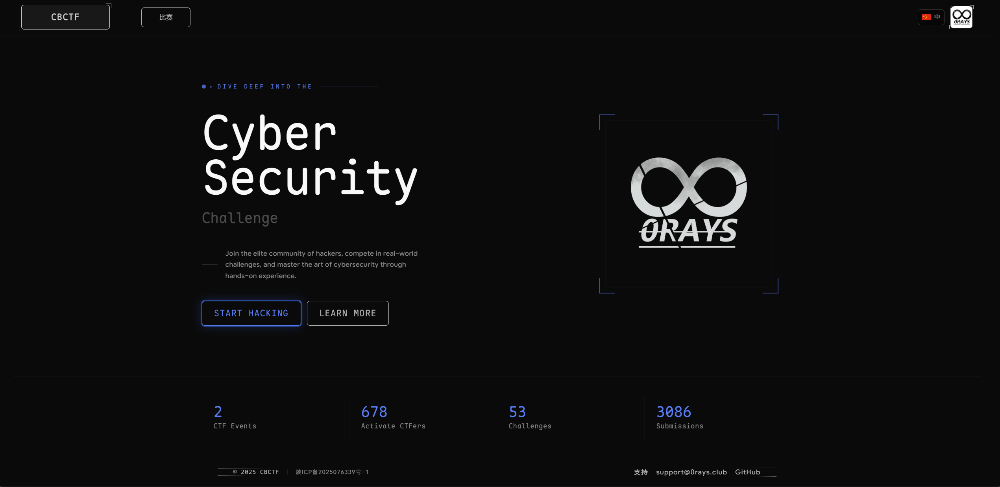

## 功能特性

### 题目类型

| 类型                | 说明                                  |
|-------------------|-------------------------------------|
| **静态题目**          | 所有队伍共用附件，flag 相同                    |
| **动态附件**          | 容器为每个队伍独立生成附件，flag 各不相同             |
| **动态容器 · Pod 模式** | 多容器共享同一 Pod 网络，容器间通过 `localhost` 通信 |
| **动态容器 · VPC 模式** | 每个容器独立 Pod，须分配静态 IP，适合渗透场景          |

每道题目均可配置多个 flag，每个 flag 独立计分。

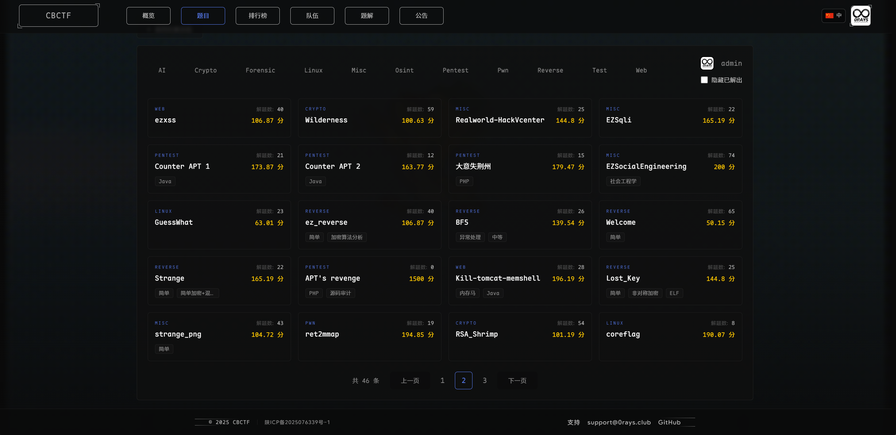

### Flag 类型

flag 前缀可在赛事设置中自定义（默认 `CBCTF`）：

| 类型       | 原始值                      | 实际 Flag                                       |
|----------|--------------------------|-----------------------------------------------|
| `static` | `static{this_is_a_flag}` | `CBCTF{this_is_a_flag}`                       |
| `leet`   | `leet{this_is_a_flag}`   | `CBCTF{ThiS-ls_4-fIaG}`                       |
| `uuid`   | `uuid{}`                 | `CBCTF{1301ea62-ccd2-4543-b663-993f87b6d44a}` |

### 平台能力

- **动态分值** — 一二三血额外获得题目分值的 5% / 3% / 1%
- **Frp 内网穿透** — 容器端口转发，保留原始客户端 IP
- **SMTP 邮件验证** — 注册验证与密码找回
- **Writeup 管理** — 支持收集与批量下载
- **OAuth / OIDC** — 第三方认证，支持用户组自动分配
- **平台品牌化** — Logo、名称、主题色等全局配置
- **热重载配置** — 所有系统配置修改即时生效，无需重启
- **Webhook** - GET / POST
- **国际化（i18n）** — 多语言界面支持
- **Prometheus 监控** — 完整的运行时指标暴露
- **Redis 缓存 / 任务队列** + **PostgreSQL 数据存储** + **NFS 网络存储**

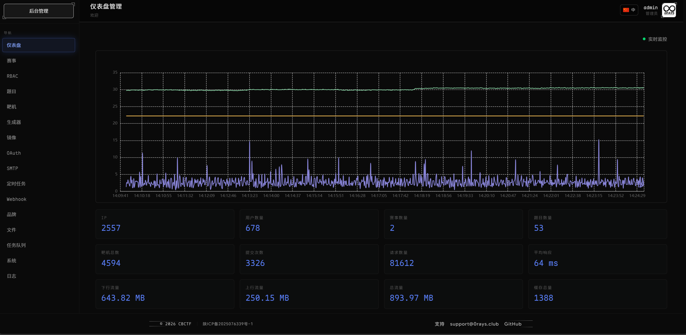
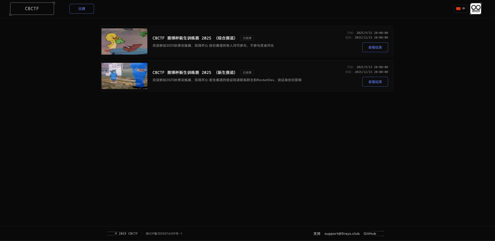

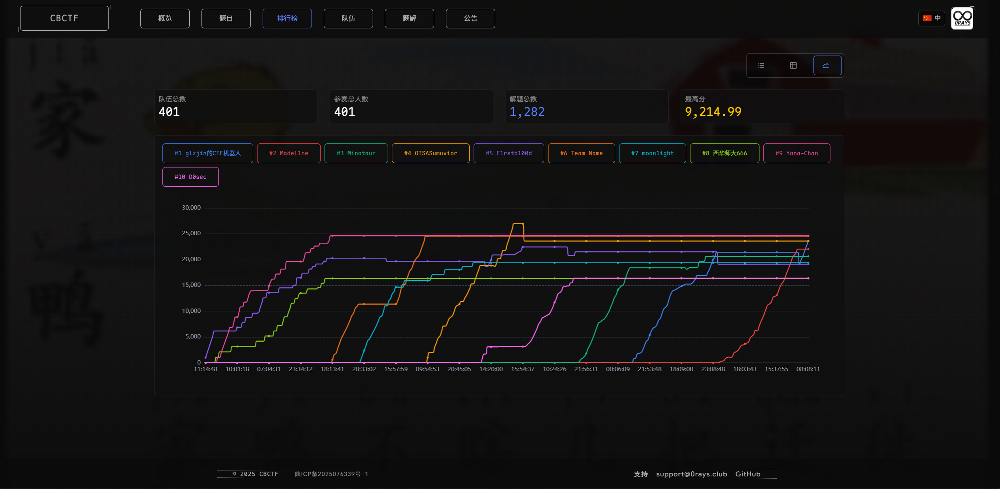

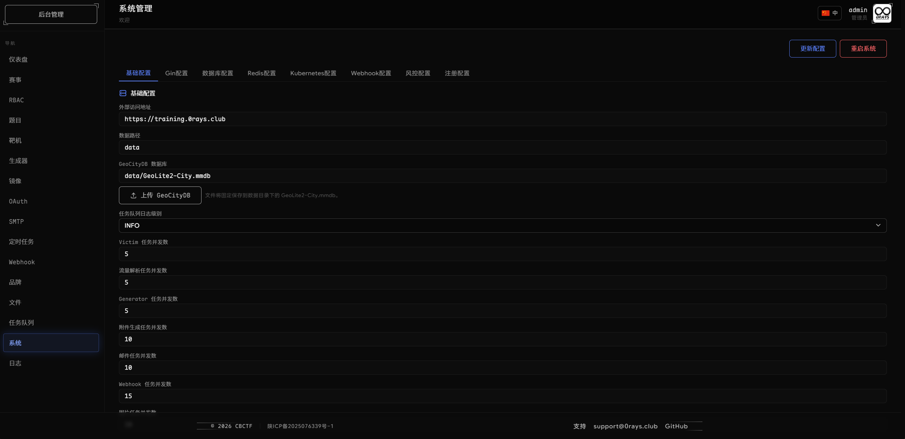
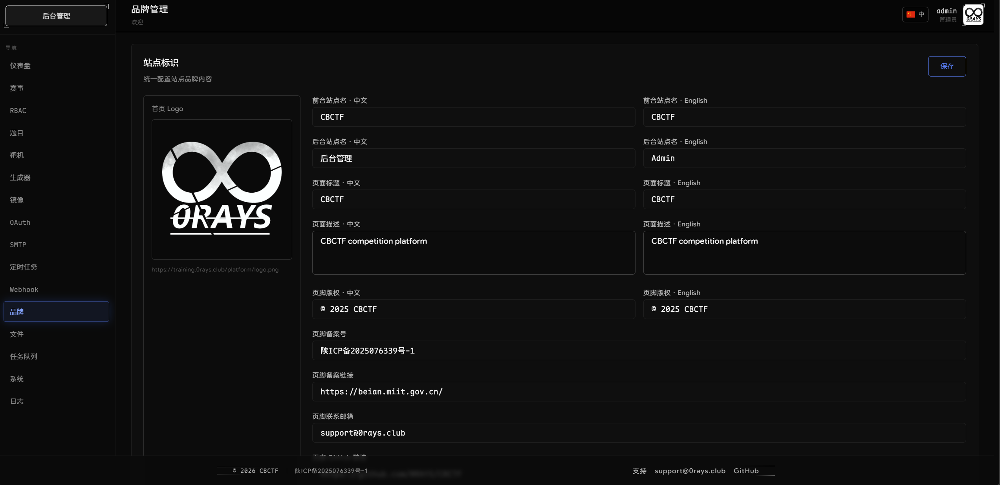
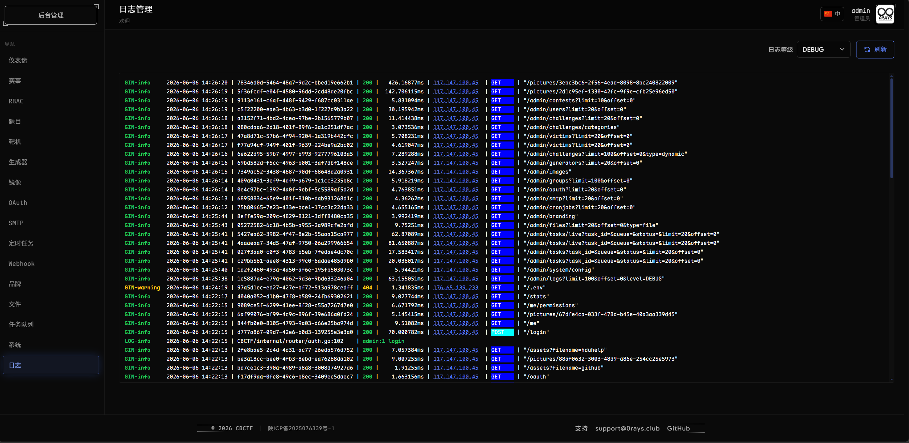

## 构建

```bash
# 1. 构建前端（静态文件会被嵌入二进制）
cd frontend && pnpm install && pnpm run build && cd ..

# 2. 构建后端（流量抓取功能依赖 libpcap，需启用 CGO）
CGO_ENABLED=1 go build -ldflags="-s -w" -trimpath -o CBCTF .
```

也可直接使用 Docker 完成两阶段构建：

```bash
docker build -t cbctf .
```

## 动态容器

### 网络模式

后端通过 `docker-compose` 配置自动识别网络模式：

| 模式      | 判断条件              | 说明                              |
|---------|-------------------|---------------------------------|
| **Pod** | 未配置 `networks` 字段 | 使用默认网络，容器间可直接通信                 |
| **VPC** | 配置了 `networks` 字段 | 基于 Kube-OVN 的 VPC 网络隔离，需手动指定 IP |

### 配置示例

**Pod 模式**

```yaml
version: '3'
services:
  web:
    image: nginx:alpine
    x-kubevirt: false
    ports:
      - "80:80"
```

> 完整示例：[example/pods/pod/docker-compose.yaml](example/pods/pod/docker-compose.yaml)

**VPC 模式（含 KubeVirt 虚拟机）**

```yaml
version: '3'
services:
  web:
    image: nginx:alpine
    x-kubevirt: true
    x-boot:
      bootloader: efi
      secure_boot: false
    x-cloudinit:
      users:
        - name: root
    networks:
      vpc:
        ipv4_address: 192.168.1.10
        mac_address: "00:00:00:00:01:01"
networks:
  vpc:
    ipam:
      config:
        - subnet: 192.168.1.0/24
          gateway: 192.168.1.1
```

> 完整示例：[example/pods/vpc/docker-compose.yaml](example/pods/vpc/docker-compose.yaml)

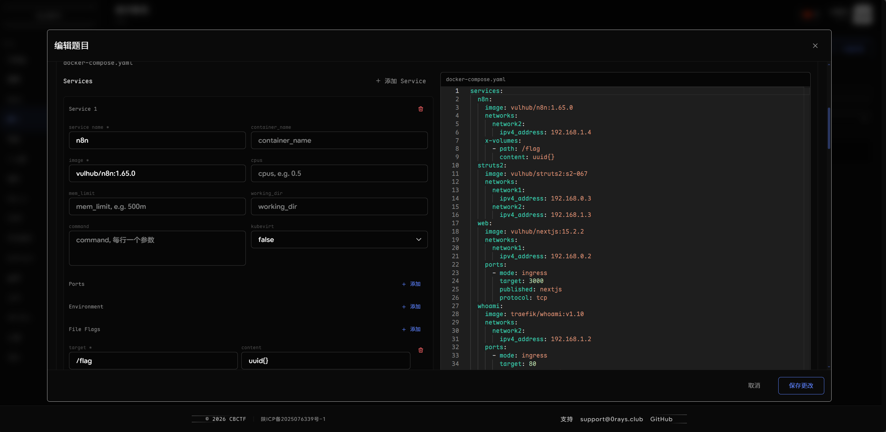
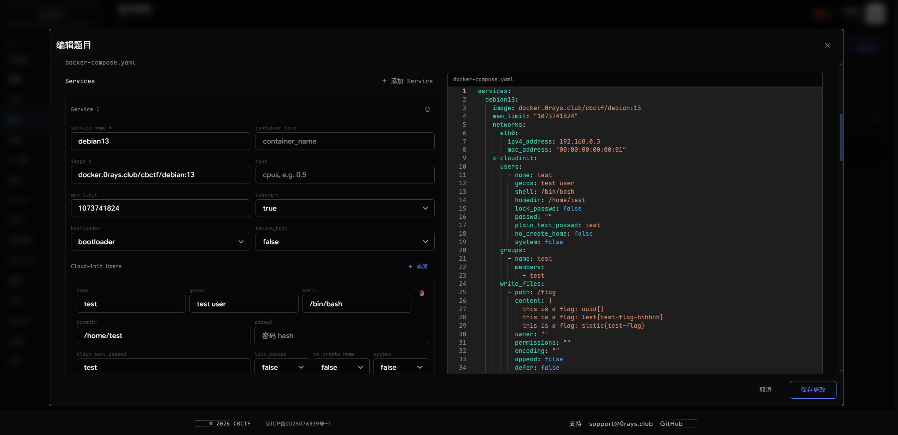
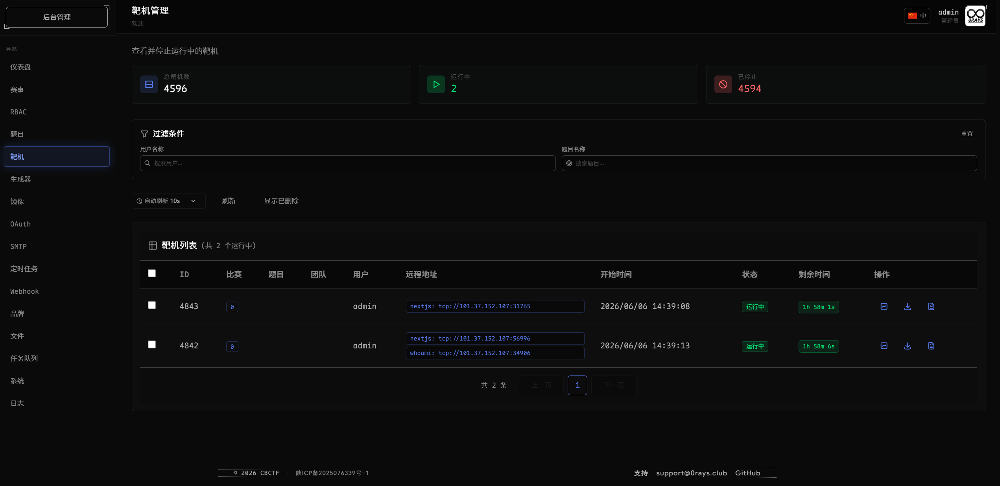
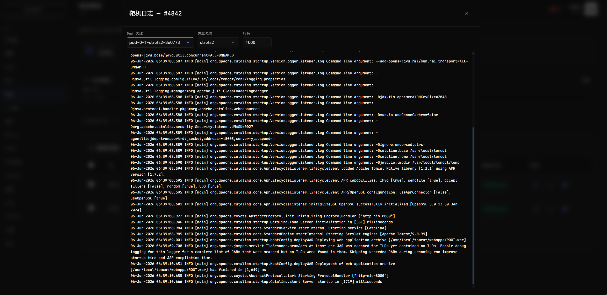
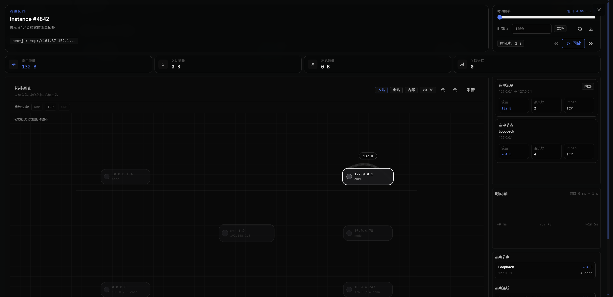

## 动态附件

基于 Kubernetes 容器化生成，支持上传 Python 脚本，在隔离环境中为每个队伍生成唯一附件。

**生成器合约：**

- 容器必须包含 `sleep` 和 `unzip`
- 脚本路径固定为 `/root/run.sh <team_id> <base64_encoded_flags>`
- 产物须写入 `/root/mnt/attachments/{id}.zip`
- 禁止使用 `latest` 镜像标签

> 完整示例：[example/dynamic/README.md](example/dynamic/README.md)

## Kubernetes 依赖

动态容器与动态附件功能依赖以下组件：

| 组件                                                               | 用途       |
|------------------------------------------------------------------|----------|
| [Kube-OVN](https://kubeovn.github.io/docs/stable/start/prepare/) | VPC 网络隔离 |
| [Multus CNI](https://github.com/k8snetworkplumbingwg/multus-cni) | 多网络接口    |
| [KubeVirt](https://kubevirt.io/)                                 | 虚拟机调度    |

## 许可证

本项目采用 [GNU Affero General Public License v3.0](LICENSE) 开源协议。
